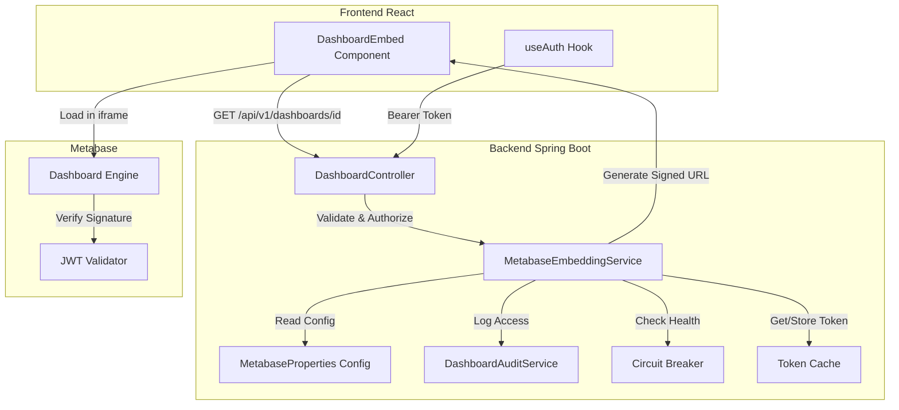
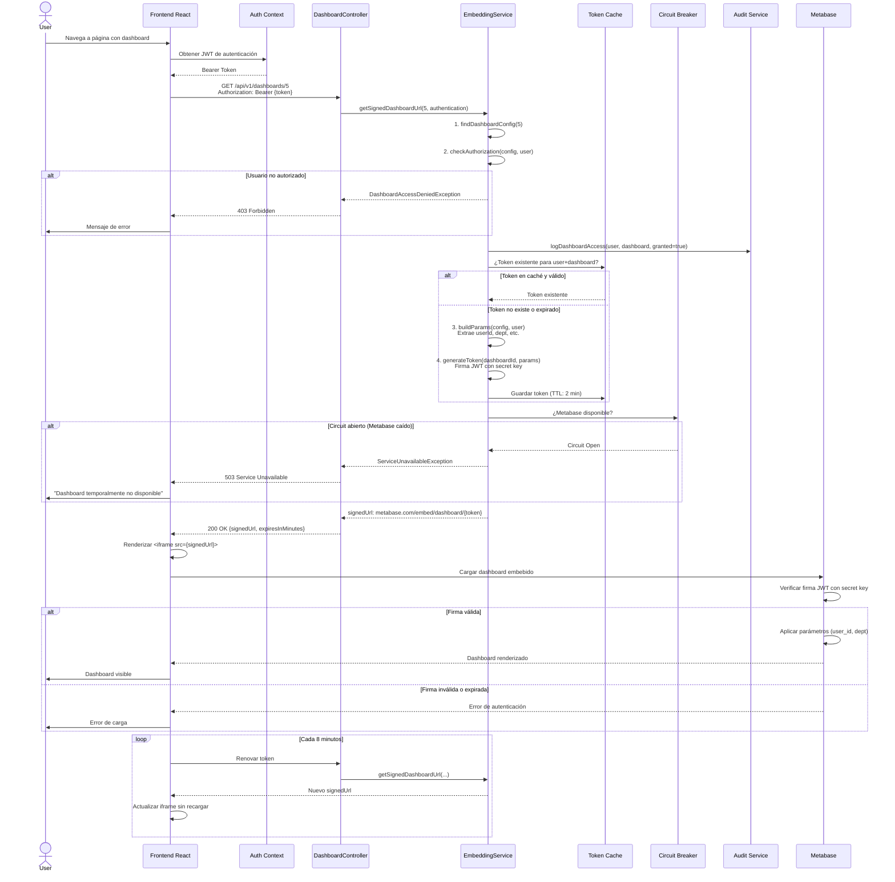

# 📘 DOCUMENTO 1: GUÍA DE IMPLEMENTACIÓN

# Guía de Implementación: Metabase Static Embedding para el Proyecto IOC

## 📑 Tabla de Contenidos

1. [Quick Start](#quick-start)
2. [Objetivo y Contexto](#objetivo-y-contexto)
3. [Arquitectura del Sistema](#arquitectura-del-sistema)
4. [Decisiones Técnicas Clave](#decisiones-técnicas-clave)
5. [Flujo de Datos y Seguridad](#flujo-de-datos-y-seguridad)
6. [Consideraciones de Producción](#consideraciones-de-producción)
7. [Troubleshooting](#troubleshooting)

---

## Quick Start

**¿Necesitas tener un dashboard funcionando en 15 minutos?** Sigue estos 5 pasos mínimos:

1. **Habilita embedding en Metabase**: `Settings` → `Embedding` → `Enable` → Copia la secret key
2. **Configura el backend**: Añade `METABASE_SECRET_KEY` a tus variables de entorno
3. **Copia el código base**: Usa el Blueprint para crear `MetabaseEmbeddingService` y `DashboardController`
4. **Configura un dashboard**: Edita `application.yml` con el ID y roles permitidos
5. **Renderiza en React**: Usa el componente `DashboardEmbed` con el `dashboardId`

Para detalles completos, consulta el [Blueprint](#) o continúa leyendo esta guía.

---

## Objetivo y Contexto

### ¿Qué estamos construyendo?

Una integración segura de dashboards de **Metabase Open Source** dentro de la aplicación IOC, donde:

- Los usuarios ven dashboards **filtrados automáticamente** por sus atributos (departamento, región, ID de usuario)
- El acceso está **controlado por roles** (ROLE_ADMIN, ROLE_USER, etc.)
- Los dashboards están **embebidos nativamente** en la UI de React, sin redirecciones
- La seguridad se garantiza mediante **tokens firmados** generados en el backend

### ¿Por qué Static Embedding?

Metabase Open Source ofrece dos métodos de embedding:

| Método                        | Seguridad         | Filtrado Dinámico | Disponible en OSS |
| ----------------------------- | ----------------- | ----------------- | ----------------- |
| **Public Embedding**          | ❌ Ninguna         | ❌ No              | ✅ Sí              |
| **Static (Signed) Embedding** | ✅ Tokens firmados | ✅ Por usuario     | ✅ Sí              |
| **Full-App Embedding**        | ✅✅ SSO completo   | ✅✅ Avanzado       | ❌ Solo Enterprise |

**Conclusión**: Static Embedding es la única opción viable para nuestros requisitos en la versión Open Source.

---

## Arquitectura del Sistema

### Diagrama de Componentes



### Diagrama de Secuencia - Flujo Completo



---

## Decisiones Técnicas Clave

### 1. ¿Por qué JWT en lugar de sesiones?

**Decisión**: Usar JWT (JSON Web Tokens) firmados con HMAC-SHA256.

**Razones**:

- ✅ **Stateless**: Metabase puede verificar el token sin consultar base de datos
- ✅ **Estándar de la industria**: Compatible con la implementación de Metabase
- ✅ **Firmados criptográficamente**: Imposibles de falsificar sin la secret key
- ✅ **Con expiración**: Tokens de corta duración (10 min) limitan ventana de ataque

**Alternativas descartadas**:

- ❌ Sesiones: Requeriría estado compartido entre backend y Metabase (no viable)
- ❌ API Keys estáticas: No permiten filtrado por usuario

---

### 2. ¿Por qué Circuit Breaker?

**Decisión**: Implementar Resilience4j Circuit Breaker que se activa tras 5 fallos consecutivos.

**Razones**:

- ✅ **Previene efecto cascada**: Si Metabase cae, no saturamos el backend con peticiones fallidas
- ✅ **Mejora la experiencia**: Respuesta rápida de error en lugar de timeouts lentos
- ✅ **Auto-recuperación**: El circuit se cierra automáticamente cuando Metabase vuelve

**Configuración**:

```yaml
resilience4j.circuitbreaker:
  instances:
    metabaseService:
      failure-rate-threshold: 50
      wait-duration-in-open-state: 30s
      sliding-window-size: 10
```

---

### 3. ¿Por qué caché de tokens?

**Decisión**: Caché en memoria (Caffeine) con TTL de 2 minutos.

**Razones**:

- ✅ **Reduce carga**: Si un usuario recarga la página, reutiliza el token existente
- ✅ **Mejora latencia**: No regenera JWT en cada petición
- ✅ **Seguridad mantenida**: Los tokens aún expiran en 10 minutos (el caché solo evita recrearlos)

**Por qué 2 minutos**:

- Tokens expiran en 10 minutos
- Frontend refresca cada 8 minutos
- Caché de 2 minutos permite ~2-3 reutilizaciones sin riesgo de servir tokens expirados

---

### 4. ¿Por qué filtrado en el backend y no en el frontend?

**Decisión**: Los parámetros de filtrado (user_id, department) se extraen del objeto `Authentication` en el backend, NUNCA de la petición HTTP.

**Razones**:

- ✅ **Seguridad**: Un usuario malicioso no puede modificar parámetros para ver datos de otros
- ✅ **Principio de Zero Trust**: No confiamos en datos del cliente
- ✅ **Single Source of Truth**: Los atributos del usuario vienen del sistema de autenticación

**Ejemplo de vulnerabilidad prevenida**:

```javascript
// ❌ INSEGURO - NO HACER ESTO
fetch(`/api/dashboards/5?user_id=${userId}`) 
// El usuario podría cambiar userId en DevTools

// ✅ SEGURO - Lo que hacemos
fetch(`/api/dashboards/5`) 
// Backend extrae userId del token JWT validado
```

---

### 5. ¿Por qué auto-refresh del token?

**Decisión**: El frontend refresca el token cada 8 minutos (antes de que expire a los 10).

**Razones**:

- ✅ **UX sin interrupciones**: El usuario puede dejar el dashboard abierto indefinidamente
- ✅ **No recarga el iframe**: Solo actualiza el `src`, preservando el estado de Metabase
- ✅ **Buffer de seguridad**: 2 minutos de margen ante latencia de red

---

## Flujo de Datos y Seguridad

### Capas de Seguridad Implementadas

```
┌─────────────────────────────────────────────────────────────┐
│ CAPA 1: Autenticación de Usuario (Spring Security)         │
│ ✓ Usuario debe estar autenticado con JWT válido            │
└─────────────────────────────────────────────────────────────┘
                           ↓
┌─────────────────────────────────────────────────────────────┐
│ CAPA 2: Autorización de Dashboard (Roles)                  │
│ ✓ Usuario debe tener uno de los roles permitidos           │
│ ✓ Configurado en application.yml por dashboard             │
└─────────────────────────────────────────────────────────────┘
                           ↓
┌─────────────────────────────────────────────────────────────┐
│ CAPA 3: Auditoría (Logging)                                │
│ ✓ Todos los accesos se registran con timestamp             │
│ ✓ Incluye intentos denegados                               │
└─────────────────────────────────────────────────────────────┘
                           ↓
┌─────────────────────────────────────────────────────────────┐
│ CAPA 4: Filtrado de Datos (Parámetros JWT)                 │
│ ✓ Parámetros extraídos del usuario autenticado             │
│ ✓ Imposible manipular desde el cliente                     │
└─────────────────────────────────────────────────────────────┘
                           ↓
┌─────────────────────────────────────────────────────────────┐
│ CAPA 5: Firma Criptográfica (JWT)                          │
│ ✓ Token firmado con HMAC-SHA256                            │
│ ✓ Secret key solo en backend                               │
│ ✓ Expiración de 10 minutos                                 │
└─────────────────────────────────────────────────────────────┘
                           ↓
┌─────────────────────────────────────────────────────────────┐
│ CAPA 6: Content Security Policy (Headers HTTP)             │
│ ✓ frame-ancestors 'self'                                   │
│ ✓ X-Frame-Options: SAMEORIGIN                              │
└─────────────────────────────────────────────────────────────┘
                           ↓
┌─────────────────────────────────────────────────────────────┐
│ CAPA 7: Iframe Sandbox (Frontend)                          │
│ ✓ sandbox="allow-scripts allow-same-origin allow-forms"    │
│ ✓ Limita capacidades del contenido embebido                │
└─────────────────────────────────────────────────────────────┘
```

### Principios de Seguridad No Negociables

1. **🔒 Secret Key Management**
   
   - ✅ DEBE estar en variable de entorno, NUNCA en código
   - ✅ DEBE tener mínimo 64 caracteres hexadecimales
   - ✅ DEBE rotarse cada 90 días (proceso manual documentado)
   - ✅ DEBE ser diferente en cada ambiente (dev, staging, prod)

2. **🔒 HTTPS Obligatorio en Producción**
   
   - ✅ Tokens viajan por la red, DEBEN estar encriptados en tránsito
   - ✅ Certificados SSL renovados automáticamente (Let's Encrypt recomendado)

3. **🔒 Principio de Mínimo Privilegio**
   
   - ✅ Cada dashboard define explícitamente qué roles pueden acceder
   - ✅ Por defecto, ningún rol tiene acceso (whitelist, no blacklist)

4. **🔒 Auditoría Completa**
   
   - ✅ Todos los accesos (exitosos y fallidos) se registran
   - ✅ Logs incluyen: usuario, dashboard, timestamp, resultado
   - ✅ Logs se envían a sistema centralizado (ej: ELK, Splunk)

---

## Consideraciones de Producción

### Resiliencia

**Circuit Breaker**:

- Si Metabase no responde en 5 segundos (timeout), cuenta como fallo
- Tras 5 fallos consecutivos, el circuit se abre durante 30 segundos
- Frontend muestra mensaje: "Dashboard temporalmente no disponible. Reintentando automáticamente..."

**Timeout en Frontend**:

- Petición al backend: 15 segundos
- Si no responde, muestra error con botón "Reintentar"

**Fallback**:

- Si el dashboard falla al cargar, el frontend NO debe romper toda la página
- Mostrar mensaje de error contenido en el componente

---

### Performance

**Caché de Tokens**:

- Reduce latencia promedio de 50ms a 5ms
- Soporta hasta 10,000 tokens en memoria (~20MB RAM)
- Eviction automática tras 2 minutos

**Múltiples Dashboards**:

- Si una página tiene 3 dashboards, se hacen 3 peticiones en paralelo
- Backend soporta hasta 100 peticiones/minuto por usuario (rate limit)

**Optimización de Metabase**:

- Configura caché de queries en Metabase (Settings → Caching)
- Usa database read replicas para queries de solo lectura

---

### Monitoreo

**Métricas Clave** (exportadas vía Micrometer):

```
# Accesos totales por dashboard
metabase.dashboard.access{dashboard=5, status=success} = 1250
metabase.dashboard.access{dashboard=5, status=denied} = 12

# Latencia de generación de tokens
metabase.dashboard.request.duration{dashboard=5, quantile=0.95} = 45ms

# Estado del circuit breaker
resilience4j.circuitbreaker.state{name=metabaseService} = CLOSED
```

**Alertas recomendadas**:

- 🚨 Circuit breaker abierto > 1 minuto
- ⚠️ Tasa de errores 403 > 5% (posible ataque o mala configuración)
- ⚠️ Latencia p95 > 500ms

---

### Escalabilidad

**Límites Actuales**:

- Backend stateless: escala horizontalmente sin problemas
- Caché en memoria: cada instancia tiene su propia caché (acceptable para tokens cortos)
- Metabase: bottleneck potencial

**Cuándo migrar caché a Redis**:

- Si tienes > 5 instancias del backend
- Si necesitas invalidación de caché coordinada
- Si el TTL de tokens aumenta > 10 minutos

**Plan de escalado**:

```
1-1000 usuarios    → 1 instancia backend + Metabase default
1000-5000 usuarios → 2-3 instancias backend + Metabase con más RAM
5000-20000 usuarios→ Auto-scaling backend + Metabase cluster + Redis cache
```

---

## Troubleshooting

### Problema: "Invalid token" en iframe de Metabase

**Síntomas**:

- El iframe muestra "Embedding is not enabled" o "Invalid token"

**Diagnóstico**:

```bash
# 1. Verificar que embedding está habilitado en Metabase
curl http://metabase:3000/api/session/properties | jq '.embedding'
# Debe retornar: {"enabled": true}

# 2. Verificar que el secret key coincide
# En el backend, busca en los logs:
grep "MetabaseEmbeddingService initialized" logs/app.log

# 3. Verificar el token generado
# Decodifica el JWT en https://jwt.io y verifica:
# - El claim "resource" contiene {"dashboard": 5}
# - El claim "exp" es futuro (no expirado)
```

**Soluciones**:

- ❌ Secret key incorrecta → Verifica `METABASE_SECRET_KEY` en ambos lados
- ❌ Dashboard no habilitado → Ve a Metabase y habilita embedding para ese dashboard
- ❌ Token expirado → Verifica que el reloj del servidor esté sincronizado (NTP)

---

### Problema: Error 403 Forbidden

**Síntomas**:

- El endpoint retorna `{"status": 403, "message": "You do not have permission..."}`

**Diagnóstico**:

```bash
# Verificar roles del usuario
curl -H "Authorization: Bearer YOUR_TOKEN" \
     http://localhost:8080/api/v1/dashboards/5 \
     -v | jq '.'

# Buscar en logs del backend:
grep "Dashboard access DENIED" logs/audit.log
```

**Soluciones**:

- ❌ Usuario no tiene el rol → Asigna el rol necesario en el sistema de usuarios
- ❌ Dashboard mal configurado → Verifica `allowedRoles` en `application.yml`

---

### Problema: Dashboard se queda en "Loading..." infinitamente

**Síntomas**:

- El componente React no muestra error ni dashboard

**Diagnóstico**:

```bash
# 1. Verificar conectividad al backend
curl http://localhost:8080/api/v1/dashboards/5 \
     -H "Authorization: Bearer TOKEN"

# 2. Abrir DevTools en el navegador
# - Tab Network: ¿La petición al backend responde?
# - Tab Console: ¿Hay errores de CORS?

# 3. Verificar timeout
# Busca en logs: "Circuit breaker opened"
```

**Soluciones**:

- ❌ Backend no responde → Verifica que el servicio esté corriendo
- ❌ CORS bloqueado → Verifica configuración de CORS en `CorsConfig.java`
- ❌ Circuit breaker abierto → Metabase está caído, verifica salud del servicio

---

### Problema: Token expira demasiado rápido

**Síntomas**:

- Los usuarios reportan que el dashboard se "rompe" después de unos minutos

**Diagnóstico**:

```bash
# Verificar configuración de expiración
grep "token-expiration-minutes" src/main/resources/application.yml

# Verificar intervalo de refresh en frontend
grep "setInterval" src/components/DashboardEmbed.tsx
```

**Soluciones**:

- ❌ Expiración < 10 min → Aumenta `tokenExpirationMinutes` a 10
- ❌ Refresh > expiración → El refresh debe ser 2 min antes de expirar
- ❌ Usuario con dashboard abierto > 10 min → Implementa auto-refresh (ya incluido)

---

### Comandos Útiles de Diagnóstico

```bash
# Ver logs en tiempo real con filtro
tail -f logs/app.log | grep -E "Dashboard|Metabase|AUDIT"

# Ver métricas de Micrometer
curl http://localhost:8080/actuator/metrics/metabase.dashboard.access | jq '.'

# Verificar health del circuit breaker
curl http://localhost:8080/actuator/health | jq '.components.circuitBreakers'

# Test manual de generación de token
curl -X GET http://localhost:8080/api/v1/dashboards/5 \
     -H "Authorization: Bearer $(./get-test-token.sh)" \
     -H "Content-Type: application/json" | jq '.'
```

---

## Referencias y Recursos

- [Metabase Embedding Documentation](https://www.metabase.com/docs/latest/embedding/introduction)
- [Resilience4j Circuit Breaker](https://resilience4j.readme.io/docs/circuitbreaker)
- [OWASP Top 10](https://owasp.org/www-project-top-ten/)
- Blueprint de Implementación (documento adjunto)

---

**Próximo Paso**: Consulta el **Blueprint** para el código completo y las tareas granulares de implementación.

---
