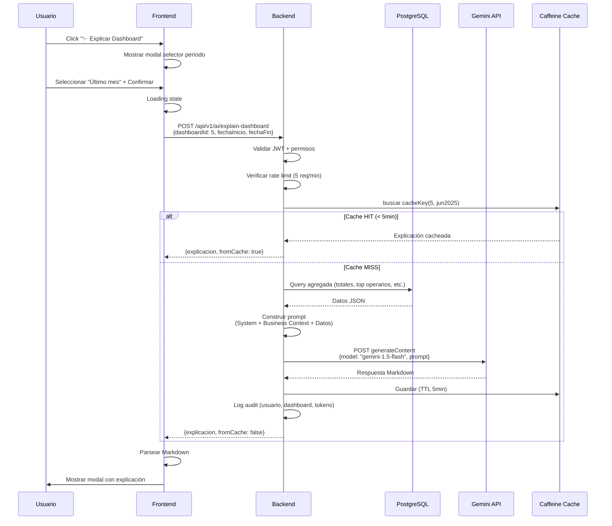

# Feature Plan: Explicación de Dashboards con Gemini AI

> **ID**: FP-001  
> **Título**: Dashboard AI Explanation - Insights Automáticos con Gemini  
> **Autor**: Product Team  
> **Fecha Creación**: 2025-11-11  
> **Estado**: 🟡 DRAFT - Requiere Decisión sobre Alternativas  
> **Prioridad**: MEDIUM (Feature Valor Agregado)  
> **Complejidad Estimada**: 7/10  

---

## 📋 ÍNDICE

1. [Contexto y Problema](#1-contexto-y-problema)
2. [Solución Propuesta](#2-solución-propuesta)
3. [Alternativas Técnicas](#3-alternativas-técnicas-decisión-requerida)
4. [Arquitectura y Diseño](#4-arquitectura-y-diseño)
5. [Contexto de Negocio Necesario](#5-contexto-de-negocio-pendiente)
6. [Plan de Implementación](#6-plan-de-implementación)
7. [Consideraciones Técnicas](#7-consideraciones-técnicas)
8. [Decisiones Pendientes](#8-decisiones-pendientes)

---

## 1. CONTEXTO Y PROBLEMA

### 1.1. Problema Actual

**Usuarios no técnicos tienen dificultad para interpretar dashboards de Metabase**:

- ✅ Los dashboards muestran datos correctos (gráficos de producción, KPIs, tendencias)
- ❌ Usuarios necesitan experiencia en análisis de datos para extraer insights
- ❌ No hay contexto sobre qué significa cada gráfico en términos de negocio
- ❌ Gerentes pierden tiempo analizando manualmente patrones y anomalías

**Ejemplo Real**:
```
Dashboard visible: "Carlos González - 15,234 unidades en junio 2025"
Usuario ve: Un gráfico de barras con números
Usuario necesita: "Carlos lidera producción con 23% más que el promedio. 
                   Sugiere reconocimiento y análisis de sus métodos."
```

### 1.2. Oportunidad

**Agregar capa de inteligencia artificial** que:
- Genere explicaciones en lenguaje natural sobre los datos visualizados
- Identifique patrones, tendencias y anomalías automáticamente
- Sugiera acciones basadas en los datos (insights accionables)
- Reduzca el tiempo de análisis de 30 min → 2 min

### 1.3. Usuarios Objetivo

| Rol | Necesidad | Beneficio |
|-----|-----------|-----------|
| **Gerentes** | Entender rápidamente estado de producción | Toma de decisiones más rápida |
| **Administradores** | Identificar problemas operacionales | Detección temprana de anomalías |
| **Analistas de Negocio** | Validar hipótesis con datos | Confirmación automática de insights |

---

## 2. SOLUCIÓN PROPUESTA

### 2.1. ¿Qué Hará la Feature?

**Botón "✨ Explicar Dashboard"** que al presionarse:

1. **Captura el contexto**: Dashboard ID, período visualizado, filtros aplicados
2. **Consulta datos reales**: Query a PostgreSQL con los mismos datos del dashboard
3. **Genera explicación con Gemini AI**:
   - Resumen ejecutivo (2-3 líneas clave)
   - 3-5 Key Points principales (datos más relevantes)
   - 1-3 Insights accionables (sugerencias de negocio)
4. **Muestra resultado en modal** con formato Markdown profesional

### 2.2. Ejemplo de Output

```markdown
📊 RESUMEN EJECUTIVO
En junio 2025 se produjeron 145,320 unidades (32.4 toneladas) distribuidas 
entre 18 operarios. Carlos González lidera con 15,234 unidades en 23 días trabajados.

🔑 KEY POINTS
• Top 3 operarios (González, Pérez, Martínez) concentran el 31% de producción total
• Turno día supera al nocturno en 20% de eficiencia (82K vs 63K unidades)
• MAQ-001 procesó 35% del volumen total, sugiriendo dependencia operacional crítica
• Pico de producción el 15/06 con 7,234 unidades (+85% vs promedio diario)
• Material SKU 45001 (Caja Grande) representa 42% del output mensual

⚡ INSIGHTS ACCIONABLES
• Considerar capacitación para 8 operarios con <5000 unidades/mes (44% bajo objetivo)
• Evaluar mantenimiento preventivo en MAQ-001 por alto uso (riesgo de cuello de botella)
• Analizar causa del pico del 15/06 (posible jornada extra o metodología replicable)
• Investigar brecha turno día/noche (posible problema de iluminación o fatiga)

⚠️ ALERTAS
• 3 operarios con 0 registros en últimos 7 días (ausencias no registradas)
• SKU 45003 con 0 producción en junio (posible falta de materia prima)
```

---

## 3. ALTERNATIVAS TÉCNICAS (DECISIÓN REQUERIDA)

### ⚠️ LIMITACIÓN TÉCNICA CRÍTICA

**NO es posible clickear gráficos individuales dentro del iframe de Metabase** debido a:
- **Same-Origin Policy**: El iframe proviene de dominio diferente (Metabase)
- **No hay acceso al DOM interno** del iframe desde el frontend
- **Metabase no expone eventos** de clicks en gráficos vía postMessage

### 🎯 ALTERNATIVA A: Botón Global - Explicación del Dashboard Completo (RECOMENDADO MVP)

**Ubicación**: Botón flotante en la esquina superior derecha del contenedor del iframe

```
┌─────────────────────────────────────────────────┐
│  Dashboard de Producción        [✨ Explicar]  │ ← Botón aquí
├─────────────────────────────────────────────────┤
│  ┌────────────────────────────────────────┐    │
│  │                                        │    │
│  │     IFRAME DE METABASE                 │    │
│  │     (gráfico 1, gráfico 2, etc.)      │    │
│  │                                        │    │
│  └────────────────────────────────────────┘    │
└─────────────────────────────────────────────────┘
```

**Funcionamiento**:
- Analiza **TODOS los datos** del dashboard completo
- Usa el `dashboardId` para determinar qué queries ejecutar
- Genera explicación holística del estado visualizado

**Pros**:
- ✅ Implementación simple (2-3 días)
- ✅ No requiere cambios en Metabase
- ✅ Funciona sin sincronización con iframe
- ✅ Cubre el 80% del valor del negocio

**Contras**:
- ❌ No explica gráficos individuales
- ❌ Si hay 10 gráficos, explicación puede ser larga

**Decisión de UX**: Poner selector de período manual
```tsx
[Período: ▼ Último mes] [✨ Explicar Dashboard]
```

---

### 🎯 ALTERNATIVA B: Selector de Gráfico + Botón (FASE 2)

**Ubicación**: Panel lateral con thumbnails de gráficos

```
┌────────────────────────────┬────────────────────┐
│  Dashboard de Producción   │  📊 ANÁLISIS AI    │
├────────────────────────────┤                    │
│  ┌──────────────────────┐  │ ▢ Gráfico 1       │
│  │                      │  │   Producción Total │
│  │  IFRAME METABASE     │  │                    │
│  │                      │  │ ☑ Gráfico 2       │← Usuario selecciona
│  └──────────────────────┘  │   Top Operarios    │
│                            │                    │
│                            │ [✨ Explicar]      │
└────────────────────────────┴────────────────────┘
```

**Funcionamiento**:
- **Metadata de Dashboard**: Configurar en backend qué gráficos tiene cada dashboard
- Usuario selecciona checkbox del gráfico de interés
- Backend ejecuta query específica para ese gráfico
- Gemini recibe contexto reducido (solo datos de ese gráfico)

**Pros**:
- ✅ Explicaciones más focalizadas y precisas
- ✅ Permite análisis profundo de gráfico específico
- ✅ Mejor UX para dashboards con muchos gráficos (>5)

**Contras**:
- ❌ Requiere mantenimiento manual de metadata
- ❌ Más complejo (5-7 días adicionales)
- ❌ Si Metabase cambia, metadata se desincroniza

**Metadata Example**:
```yaml
dashboards:
  - id: 5
    nombre: "Dashboard Operacional"
    graficos:
      - id: "grafico_1"
        titulo: "Producción por Operario"
        query: "SELECT ... FROM fact_production WHERE ..."
        tipo: "bar_chart"
      - id: "grafico_2"
        titulo: "Tendencia Diaria"
        query: "SELECT fecha, SUM(cantidad) ..."
        tipo: "line_chart"
```

---

### 🎯 ALTERNATIVA C: Integración con Metabase API (ÓPTIMO, MÁS COMPLEJO)

**Usa Metabase REST API** para obtener datos exactos del dashboard

```
Backend → Metabase API → GET /api/dashboard/5
       → Metabase API → POST /api/card/123/query (ejecutar query de gráfico)
       → Obtener datos JSON exactos
       → Enviar a Gemini
```

**Pros**:
- ✅ Datos 100% sincronizados con lo que ve el usuario
- ✅ Funciona con filtros dinámicos de Metabase
- ✅ No requiere duplicar queries en el backend

**Contras**:
- ❌ Requiere autenticación con Metabase (API Key o Session)
- ❌ Dependencia externa (si Metabase cae, feature no funciona)
- ❌ Complejidad alta (7-10 días)
- ❌ Rate limits de Metabase a considerar

**Decisión**: ⚠️ **Dejar para Fase 3** (después de validar valor con Alternativa A)

---

### 📊 COMPARACIÓN DE ALTERNATIVAS

| Criterio | Alt. A: Botón Global | Alt. B: Selector | Alt. C: API Metabase |
|----------|---------------------|------------------|---------------------|
| **Complejidad** | 🟢 Baja (3d) | 🟡 Media (7d) | 🔴 Alta (10d) |
| **Precisión** | 🟡 Dashboard completo | 🟢 Por gráfico | 🟢 100% exacto |
| **Mantenimiento** | 🟢 Mínimo | 🟡 Metadata manual | 🟢 Auto-sync |
| **Riesgo Técnico** | 🟢 Bajo | 🟡 Medio | 🔴 Alto |
| **Valor Usuario** | 🟢 80% | 🟢 95% | 🟢 100% |

**✅ RECOMENDACIÓN**: Empezar con **Alternativa A (MVP)**, validar con usuarios, luego migrar a B o C.

---

## 4. ARQUITECTURA Y DISEÑO

### 4.1. Flujo de Datos Completo (Alternativa A - MVP)



### 4.2. Stack Tecnológico Nuevo

| Componente | Tecnología | Versión | Justificación |
|------------|-----------|---------|---------------|
| **AI SDK (Backend)** | Spring WebClient | Nativo | Llamadas HTTP asíncronas a Gemini API |
| **Markdown Parser (FE)** | react-markdown | ^9.0.0 | Renderizar respuestas formateadas |
| **Cache** | Caffeine | Ya incluido | Cache in-memory (ya está en proyecto) |
| **Rate Limiter** | Resilience4j | Ya incluido | Limitar requests a Gemini |
| **Syntax Highlight** | react-syntax-highlighter | ^15.5.0 | Si Gemini devuelve código/SQL |

**✅ Sin dependencias nuevas en backend**, solo frontend.

### 4.3. Nuevos Endpoints

```java
POST /api/v1/ai/explain-dashboard
```

**Request**:
```json
{
  "dashboardId": 5,
  "fechaInicio": "2025-06-01",
  "fechaFin": "2025-06-30",
  "filtros": {
    "turno": "Día",  // Opcional
    "maquina_id": 3  // Opcional
  }
}
```

**Response (200 OK)**:
```json
{
  "resumenEjecutivo": "En junio 2025 se produjeron 145,320 unidades...",
  "keyPoints": [
    "Top 3 operarios concentran el 31% de producción",
    "Turno día supera al nocturno en 20%"
  ],
  "insightsAccionables": [
    "Considerar capacitación para operarios <5000 unidades/mes"
  ],
  "explicacionCompleta": "# 📊 RESUMEN EJECUTIVO\n\n...",
  "metadata": {
    "dashboardId": 5,
    "titulo": "Dashboard Operacional",
    "periodo": {
      "fechaInicio": "2025-06-01",
      "fechaFin": "2025-06-30"
    }
  },
  "generadoAt": "2025-11-11T22:15:30Z",
  "fromCache": false,
  "tokensUsados": 1245
}
```

**Error Responses**:
```json
// 429 Too Many Requests (rate limit)
{
  "error": "RATE_LIMIT_EXCEEDED",
  "message": "Máximo 5 explicaciones por minuto. Intenta en 30 segundos.",
  "retryAfter": 30
}

// 503 Service Unavailable (Gemini API down)
{
  "error": "AI_SERVICE_UNAVAILABLE",
  "message": "Servicio de IA temporalmente no disponible. Intenta más tarde."
}
```

### 4.4. Queries SQL Necesarias

**Query 1: Totales Generales**
```sql
SELECT 
    COUNT(DISTINCT maquinista_fk) as total_operarios,
    COUNT(DISTINCT maquina_fk) as total_maquinas,
    SUM(cantidad) as produccion_total,
    SUM(peso_neto) as peso_total_kg,
    MIN(fecha_contabilizacion) as fecha_inicio,
    MAX(fecha_contabilizacion) as fecha_fin,
    COUNT(DISTINCT numero_pallet) as total_pallets
FROM fact_production
WHERE fecha_contabilizacion BETWEEN :fechaInicio AND :fechaFin;
```

**Query 2: Top Operarios**
```sql
SELECT 
    dm.codigo_maquinista,
    dm.nombre_completo,
    COUNT(DISTINCT fp.fecha_contabilizacion) as dias_trabajados,
    SUM(fp.cantidad) as total_unidades,
    ROUND(AVG(fp.cantidad), 2) as promedio_diario,
    SUM(fp.peso_neto) as total_kg
FROM fact_production fp
JOIN dim_maquinista dm ON fp.maquinista_fk = dm.id
WHERE fp.fecha_contabilizacion BETWEEN :fechaInicio AND :fechaFin
GROUP BY dm.id, dm.codigo_maquinista, dm.nombre_completo
ORDER BY total_unidades DESC
LIMIT 10;
```

**Query 3: Distribución por Turno**
```sql
SELECT 
    turno,
    SUM(cantidad) as unidades,
    COUNT(DISTINCT maquinista_fk) as operarios,
    ROUND(AVG(cantidad), 2) as promedio_por_registro
FROM fact_production
WHERE fecha_contabilizacion BETWEEN :fechaInicio AND :fechaFin
GROUP BY turno
ORDER BY unidades DESC;
```

**Query 4: Top Máquinas**
```sql
SELECT 
    dm.codigo_maquina,
    dm.nombre_maquina,
    SUM(fp.cantidad) as total_unidades,
    COUNT(DISTINCT fp.maquinista_fk) as operarios_utilizaron,
    ROUND(SUM(fp.cantidad) * 100.0 / (SELECT SUM(cantidad) FROM fact_production 
        WHERE fecha_contabilizacion BETWEEN :fechaInicio AND :fechaFin), 2) as porcentaje_produccion
FROM fact_production fp
JOIN dim_maquina dm ON fp.maquina_fk = dm.id
WHERE fp.fecha_contabilizacion BETWEEN :fechaInicio AND :fechaFin
GROUP BY dm.id, dm.codigo_maquina, dm.nombre_maquina
ORDER BY total_unidades DESC
LIMIT 5;
```

**Query 5: Tendencia Diaria (para detectar picos)**
```sql
SELECT 
    fecha_contabilizacion,
    SUM(cantidad) as produccion_dia,
    COUNT(DISTINCT maquinista_fk) as operarios_activos
FROM fact_production
WHERE fecha_contabilizacion BETWEEN :fechaInicio AND :fechaFin
GROUP BY fecha_contabilizacion
ORDER BY fecha_contabilizacion;
```

---

## 5. CONTEXTO DE NEGOCIO (PENDIENTE)

### ⚠️ INFORMACIÓN CRÍTICA QUE NECESITO QUE COMPLETES

Para que Gemini genere explicaciones relevantes, necesita entender el negocio:

```yaml
# TODO: COMPLETAR ESTA INFORMACIÓN

empresa:
  nombre: "Cambiaso"
  industria: "???"  # ¿Alimentos? ¿Empaque? ¿Manufactura?
  productos_principales: "???"  # ¿Qué fabrican exactamente?
  
metricas_clave:
  objetivo_mensual_unidades: ???  # ej: 150,000
  objetivo_diario_por_operario: ???  # ej: 500 unidades/día
  objetivo_eficiencia_turno_dia: ???  # ej: 70% del total
  
unidades_medida:
  cantidad: "???"  # ¿Es cajas? ¿pallets? ¿piezas individuales?
  peso_neto: "Kilogramos"  # ✅ confirmado
  
turnos:
  dia:
    horario: "???"  # ej: "06:00 - 18:00"
    expectativa: "???"  # ej: "Mayor productividad"
  noche:
    horario: "???"  # ej: "18:00 - 06:00"
    expectativa: "???"  # ej: "70% de turno día"
    
jornadas:
  tipos: ["???"]  # ej: ["Normal", "Extra", "Festivo"]
  impacto: "???"  # ej: "Jornada extra = 50% más pago"
  
materiales_skus:
  principales:
    - sku: 45001
      nombre: "???"  # ej: "Caja Grande 50x50"
      objetivo: ???  # ej: "40% de producción mensual"
    - sku: 45002
      nombre: "???"
      objetivo: ???

maquinas:
  tipos: ["???"]  # ej: ["Envasadora", "Selladora", "Etiquetadora"]
  maquinas_criticas: ["???"]  # ej: ["MAQ-001", "MAQ-005"]
```

**📝 Acción requerida**: Completa esto en una respuesta y lo integraré al System Prompt.

---

## 6. PLAN DE IMPLEMENTACIÓN

### FASE 1: MVP - Botón Global (3-4 días) ✅ RECOMENDADO EMPEZAR AQUÍ

#### 🔧 Backend (2 días)

**Día 1**:
- [ ] Crear `GeminiApiClient.java` con WebClient
  - Configurar timeout 30s
  - Manejo de errores (429, 503, 500)
  - DTOs para request/response de Gemini
- [ ] Crear `DashboardExplanationController.java`
  - Endpoint `POST /api/v1/ai/explain-dashboard`
  - Validación con `@Valid` del request DTO
  - Rate limiting con `@RateLimiter(name = "aiExplanation")`
- [ ] Configurar en `application.yml`:
  ```yaml
  gemini:
    api-key: ${GEMINI_API_KEY}
    model: gemini-1.5-flash
    timeout: 30s
  ```

**Día 2**:
- [ ] Crear `DashboardDataService.java`
  - Implementar las 5 queries SQL
  - Formatear datos para el prompt
- [ ] Crear `DashboardExplanationService.java`
  - Método `buildPrompt()` con System Prompt
  - Integración con cache (Caffeine)
  - Logging de audit (tokens, tiempo, usuario)
- [ ] Tests unitarios:
  - Mock de Gemini API
  - Validar caché hit/miss
  - Validar rate limiting

#### 🎨 Frontend (1-2 días)

**Día 3**:
- [ ] Instalar dependencias:
  ```bash
  npm install react-markdown react-syntax-highlighter
  npm install -D @types/react-syntax-highlighter
  ```
- [ ] Crear `components/dashboard/ExplainDashboardButton.tsx`
  - Botón con ícono Sparkles (lucide-react)
  - Estados: idle, loading, error
  - Llamada a API con axios
- [ ] Crear `components/dashboard/ExplanationModal.tsx`
  - Modal responsive con Markdown
  - Botones: Copiar, Cerrar, Regenerar (opcional)
  - Metadata del dashboard (período, cache status)

**Día 4**:
- [ ] Integrar botón en página de dashboards
- [ ] Agregar selector de período (DateRangePicker)
- [ ] Tests con Vitest:
  - Mock de API response
  - Test de loading states
  - Test de error handling

#### 🧪 Testing y Deploy (0.5 días)

- [ ] Test E2E manual con dashboard real
- [ ] Validar rate limiting (hacer 6 requests seguidos)
- [ ] Deploy a staging
- [ ] Obtener feedback de 2-3 usuarios

---

### FASE 2: Mejoras y Optimización (3-4 días) - OPCIONAL

- [ ] Implementar Alternativa B (selector de gráficos)
- [ ] Streaming de respuestas (si Gemini lo soporta)
- [ ] Exportar explicación a PDF
- [ ] Sistema de feedback (👍👎)
- [ ] Almacenar explicaciones en BD para analytics
- [ ] Comparación con período anterior (ej: "15% más que mayo")

---

### FASE 3: Avanzado (5-7 días) - FUTURO

- [ ] Integración con Metabase API (Alternativa C)
- [ ] Explicaciones personalizadas por rol (Gerente vs Operario)
- [ ] Historial de explicaciones generadas
- [ ] Fine-tuning con ejemplos reales (si Gemini lo permite)

---

## 7. CONSIDERACIONES TÉCNICAS

### 7.1. Rate Limits de Gemini (Free Tier)

**Límites Actuales** (verificar en https://ai.google.dev/pricing):
```
Gemini 1.5 Flash (Free):
- 15 requests por minuto (RPM)
- 1 millón de tokens por minuto (TPM)
- 1,500 requests por día (RPD)
```

**Mitigación**:
- ✅ Cache agresivo (5 minutos TTL por explicación)
- ✅ Rate limiting en backend (5 req/min por usuario)
- ✅ Cola de retry con backoff exponencial
- ✅ Mensaje claro al usuario si excede límite

**Estimación de Consumo**:
- Prompt promedio: ~1,500 tokens (system + data)
- Response promedio: ~500 tokens
- **Total por request**: ~2,000 tokens
- **Requests diarios estimados**: 100-200 (bien dentro del límite)

### 7.2. Calidad de Explicaciones

**Limitaciones de Gemini**:
- ❌ NO puede "ver" gráficos (solo procesa texto/JSON)
- ✅ Excelente en análisis de datos estructurados
- ✅ Bueno generando insights si el prompt es claro

**Estrategias para Mejorar Calidad**:
1. **Few-Shot Prompting**: Incluir ejemplos en System Prompt
   ```
   Ejemplo:
   Datos: {operario: "Juan", unidades: 5234, dias: 22}
   Explicación: "Juan produjo 5,234 unidades en 22 días (238 unidades/día, 
                 ligeramente bajo el objetivo de 250/día)"
   ```
2. **Structured Outputs**: Pedir formato específico
   ```
   Genera tu respuesta en este formato:
   # RESUMEN EJECUTIVO
   [2-3 líneas]
   
   # KEY POINTS
   • [punto 1]
   • [punto 2]
   ```
3. **Validación Post-Generación**: Verificar que tiene las secciones esperadas

### 7.3. Seguridad y Privacidad

**Datos Sensibles**:
- ⚠️ Nombres de operarios → Considerar anonimizar ("Operario A", "Operario B")
- ⚠️ Datos de producción → OK (no son PII)
- ✅ No enviar credenciales, emails, datos bancarios

**Audit Log**:
```java
@Entity
public class AiExplanationAudit {
    private Long id;
    private String userId;
    private Integer dashboardId;
    private LocalDate fechaInicio;
    private LocalDate fechaFin;
    private Integer tokensUsados;
    private Duration tiempoRespuesta;
    private Boolean fromCache;
    private Instant createdAt;
}
```

### 7.4. Costos Futuros (si se migra a Paid)

**Gemini 1.5 Flash Paid**:
- Input: $0.075 / 1M tokens
- Output: $0.30 / 1M tokens

**Estimación Mensual**:
- 500 requests/mes × 2,000 tokens = 1M tokens
- Costo: $0.075 (input) + $0.15 (output) = **~$0.23/mes**

**Conclusión**: Muy económico, incluso en paid tier.

---

## 8. DECISIONES PENDIENTES

### 🔴 CRÍTICAS (Bloquean Implementación)

| # | Decisión | Opciones | Recomendación | Deadline |
|---|----------|----------|---------------|----------|
| 1 | **¿Qué alternativa técnica usar?** | A, B o C | **Alternativa A (MVP)** | Ahora |
| 2 | **Completar contexto de negocio** | Ver sección 5 | Llenar template YAML | Antes de codear |
| 3 | **Obtener API Key de Gemini** | https://makersuite.google.com/app/apikey | - | Antes de testing |

### 🟡 IMPORTANTES (Afectan UX)

| # | Decisión | Opciones | Recomendación |
|---|----------|----------|---------------|
| 4 | **Ubicación del botón** | Arriba del iframe / Esquina flotante | Esquina superior derecha |
| 5 | **Selector de período** | Manual / Auto (último mes) | Manual con default "último mes" |
| 6 | **Anonimizar nombres operarios** | Sí / No | **No** (datos internos, no PII) |
| 7 | **Permitir exportar PDF** | Fase 1 / Fase 2 | Fase 2 |

### 🟢 OPCIONALES (Nice to Have)

| # | Decisión | Opciones |
|---|----------|----------|
| 8 | **Sistema de feedback (👍👎)** | Implementar / Postponer |
| 9 | **Streaming de respuesta** | Sí (más complejo) / No |
| 10 | **Comparación con período anterior** | Incluir / No incluir |

---

## 9. CHECKLIST PRE-DESARROLLO

Antes de empezar a codear, verificar:

- [ ] ✅ He leído todo el Feature Plan
- [ ] ⚠️ He decidido qué alternativa técnica usar (A, B o C)
- [ ] ⚠️ He completado el contexto de negocio (sección 5)
- [ ] ⚠️ He obtenido la API Key de Gemini
- [ ] ✅ Entiendo las limitaciones del iframe (no clickear gráficos)
- [ ] ✅ He verificado que Caffeine cache está disponible en el proyecto
- [ ] ✅ He verificado que Resilience4j está configurado
- [ ] ⚠️ He decidido si anonimizar nombres de operarios
- [ ] ⚠️ He decidido ubicación del botón y selector de período

---

## 10. PRÓXIMOS PASOS INMEDIATOS

### Paso 1: Decisión de Alternativa (5 min)

**Responde**:
> "Quiero implementar Alternativa **[A/B/C]** porque **[razón]**"

### Paso 2: Completar Contexto de Negocio (30 min)

**Completa el YAML de la sección 5** con información real de Cambiaso.

### Paso 3: Obtener API Key (2 min)

1. Ir a https://makersuite.google.com/app/apikey
2. Crear proyecto (o usar existente)
3. Generar API Key
4. Guardar en `.env` como `GEMINI_API_KEY=xxx`

### Paso 4: Confirmar para Empezar Implementación

Responde:
> "Listo para empezar. He completado checklist y contexto de negocio."

Entonces generaré los archivos de código paso a paso.

---

## 📊 MÉTRICAS DE ÉXITO

| Métrica | Objetivo | Medición |
|---------|----------|----------|
| **Tiempo de análisis** | Reducir de 30min → 5min | Encuesta usuarios |
| **Adoption rate** | 60% de usuarios usan feature 1 vez/semana | Analytics |
| **Precisión de insights** | 80% de explicaciones útiles | Feedback 👍👎 |
| **Uptime** | 99% disponibilidad | Monitoring |
| **Latencia p95** | < 5 segundos | Prometheus |

---

## 🔗 REFERENCIAS

- Gemini API Docs: https://ai.google.dev/docs
- Gemini Pricing: https://ai.google.dev/pricing
- React Markdown: https://github.com/remarkjs/react-markdown
- Metabase Embedding: https://www.metabase.com/docs/latest/embedding/introduction

---

**¿Listo para empezar?** 🚀

Completa las 3 decisiones críticas y el contexto de negocio, entonces comenzamos con la implementación.

