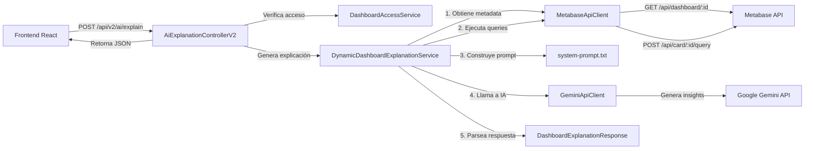

# Feature: Explicación de Dashboards con IA (v2)

## 📋 Descripción General

Esta funcionalidad permite generar explicaciones ejecutivas automáticas de dashboards de Metabase utilizando IA generativa (Google Gemini). El sistema extrae datos dinámicos desde Metabase, los procesa y envía a Gemini para generar insights accionables en lenguaje natural dirigidos a ejecutivos y tomadores de decisiones.

---

## 🎯 Problema

### Contexto
Los dashboards de Business Intelligence contienen grandes volúmenes de información visual (gráficos, tablas, KPIs), pero enfrentan los siguientes desafíos:

1. **Sobrecarga Cognitiva**: Los usuarios ejecutivos no tienen tiempo para interpretar múltiples visualizaciones y extraer conclusiones.
2. **Falta de Contexto**: Los datos sin análisis contextual no revelan tendencias, anomalías o insights accionables.
3. **Barreras de Acceso**: No todos los usuarios tienen expertise en análisis de datos para interpretar métricas complejas.
4. **Tiempo de Análisis**: Generar reportes ejecutivos manualmente consume tiempo valioso de analistas.

### Impacto del Problema
- **Decisiones Lentas**: Los ejecutivos requieren tiempo adicional para digerir los datos antes de tomar decisiones.
- **Oportunidades Perdidas**: Insights críticos pueden pasar desapercibidos en dashboards con muchas métricas.
- **Costos Operacionales**: Equipos de analistas dedicados a generar reportes ejecutivos de forma manual.

---

## 💡 Necesidad

### Requerimientos Funcionales
1. **Generación Automática de Insights**: Convertir datos visuales en texto ejecutivo comprensible.
2. **Análisis Contextual**: Identificar tendencias, anomalías y correlaciones en los datos.
3. **Recomendaciones Accionables**: Proporcionar sugerencias concretas basadas en los datos.
4. **Personalización Temporal**: Permitir análisis sobre rangos de fechas específicos.
5. **Multilingüe y Formal**: Generar reportes en español (Chile) con tono profesional y ejecutivo.

### Requerimientos No Funcionales
1. **Rendimiento**: Respuesta en menos de 10 segundos para dashboards típicos.
2. **Seguridad**: Control de acceso basado en roles (RBAC).
3. **Resiliencia**: Manejo de errores de APIs externas (Metabase, Gemini).
4. **Observabilidad**: Auditoría de accesos y métricas de uso.
5. **Escalabilidad**: Rate limiting para proteger la API de Gemini.

---

## ✅ Solución Implementada

### Arquitectura de Alto Nivel



### Componentes Principales

#### 1. **API Endpoint** ([AiExplanationControllerV2.java](file:///mnt/ssd-480/repos/captone/ioc-backend/src/main/java/com/cambiaso/ioc/controller/AiExplanationControllerV2.java))

**Endpoints:**
- `POST /api/v2/ai/explain`
- `POST /api/v2/ai/explain-dashboard` (alias)

**Características:**
- Autenticación JWT requerida
- Rate Limiting: `@RateLimiter(name = "aiExplanation")` 
- Validación de request con `@Valid`
- Control de acceso RBAC mediante `DashboardAccessService`

**Request DTO** ([DashboardExplanationRequest](file:///mnt/ssd-480/repos/captone/ioc-backend/src/main/java/com/cambiaso/ioc/dto/ai/DashboardExplanationRequest.java)):
```json
{
  "dashboardId": 42,
  "fechaInicio": "2025-01-01",
  "fechaFin": "2025-01-31",
  "filtros": {
    "planta": "Santiago",
    "linea": "Producción A"
  }
}
```

**Response DTO** ([DashboardExplanationResponse](file:///mnt/ssd-480/repos/captone/ioc-backend/src/main/java/com/cambiaso/ioc/dto/ai/DashboardExplanationResponse.java)):
```json
{
  "resumenEjecutivo": "Durante enero 2025, la producción alcanzó 12,450 unidades...",
  "keyPoints": [
    "Producción aumentó 8% vs diciembre 2024",
    "Tiempo de inactividad redujo a 2.3 horas/día"
  ],
  "insightsAccionables": [
    "Considerar aumentar turno nocturno en Línea A",
    "Revisar mantenimiento preventivo en máquina #5"
  ],
  "alertas": [
    "Tasa de defectos en turno tarde superó el umbral (4.2%)"
  ],
  "dashboardId": 42,
  "dashboardTitulo": "Producción - Planta Santiago",
  "fechaInicio": "2025-01-01",
  "fechaFin": "2025-01-31",
  "filtrosAplicados": { "planta": "Santiago" },
  "generadoEn": "2025-01-27T18:30:00Z",
  "fromCache": false,
  "tokensUsados": 1250,
  "cacheTTLSeconds": 300
}
```

#### 2. **Motor de Explicación** ([DynamicDashboardExplanationService.java](file:///mnt/ssd-480/repos/captone/ioc-backend/src/main/java/com/cambiaso/ioc/service/ai/DynamicDashboardExplanationService.java))

**Flujo de Procesamiento:**

1. **Fetch Dashboard Metadata**
   - Llama a `MetabaseApiClient.getDashboard(dashboardId)`
   - Extrae nombre del dashboard y lista de tarjetas (`dashcards`)

2. **Fetch Data for Each Card**
   - Itera sobre cada tarjeta no-textual del dashboard
   - Ejecuta la query de cada tarjeta con `runCardQuery(cardId, params)`
   - Formatea los resultados (top 10 rows, límite de 1000 chars)
   - Maneja errores individuales sin fallar toda la operación

3. **Build Dynamic Prompt**
   - Carga el [system-prompt.txt](file:///mnt/ssd-480/repos/captone/ioc-backend/src/main/resources/prompts/system-prompt.txt)
   - Construye prompt con template:
     ```
     {SYSTEM_PROMPT}
     
     DASHBOARD: {dashboardName}
     RANGO: {fechaInicio} a {fechaFin}
     
     DATOS:
     ## Card 1
     [formatted data]
     ## Card 2
     [formatted data]
     ```

4. **Call Gemini API**
   - Usa `GeminiApiClient.callGemini(prompt)`
   - Maneja timeout (90s), rate limiting y errores

5. **Parse JSON Response**
   - Extrae JSON válido de la respuesta (maneja markdown wrappers)
   - Deserializa a `GeminiJsonResponse`
   - Convierte a `DashboardExplanationResponse`

#### 3. **Cliente Metabase** ([MetabaseApiClient.java](file:///mnt/ssd-480/repos/captone/ioc-backend/src/main/java/com/cambiaso/ioc/service/metabase/MetabaseApiClient.java))

**Funcionalidades:**
- **Autenticación**: Gestión de sesión con token automático
- **Retry Automático**: Re-autentica en caso de 401 (token expirado)
- **Endpoints utilizados**:
  - `POST /api/session` - Autenticación
  - `GET /api/dashboard/:id` - Metadata del dashboard
  - `POST /api/card/:id/query` - Ejecución de queries

#### 4. **Cliente Gemini** ([GeminiApiClient.java](file:///mnt/ssd-480/repos/captone/ioc-backend/src/main/java/com/cambiaso/ioc/service/ai/GeminiApiClient.java))

**Características:**
- Retries exponenciales con backoff
- Timeouts configurables (90s por defecto)
- Manejo de errores específicos:
  - `GeminiTimeoutException` (HTTP 504)
  - `GeminiRateLimitException` (HTTP 429)
  - `GeminiApiException` (otros errores)

#### 5. **System Prompt** ([system-prompt.txt](file:///mnt/ssd-480/repos/captone/ioc-backend/src/main/resources/prompts/system-prompt.txt))

**Configuración del modelo de IA:**
```
- Rol: Analista de Datos y Consultor de Negocios Senior
- Idioma: Español (Chile)
- Tono: Profesional, formal, ejecutivo
- Formato: JSON estricto (sin markdown)
- Estructura de salida:
  * resumenEjecutivo (max 3 líneas)
  * keyPoints (3-5 puntos con métricas)
  * insightsAccionables (2-3 recomendaciones)
  * alertas (situaciones críticas)
```

---

## 🔒 Seguridad y Resiliencia

### Control de Acceso
- **Autenticación JWT**: Requerida en todos los endpoints
- **RBAC**: Verificación de roles mediante `DashboardAccessService`
- **Auditoría**: Logs de acceso (usuario, dashboard, timestamp)

### Rate Limiting
- Implementado con Resilience4j
- Protege la API de Gemini de abuso
- Configuración en `application.properties`

### Manejo de Errores
- **Timeout Gemini**: 90 segundos máximo
- **Fallback**: Respuesta de error estructurada si falla el parseo
- **Partial Success**: Si algunas tarjetas fallan, se procesan las demás

---

## 📊 Observabilidad

### Logs Estructurados
```java
log.info("V2 AI explanation requested - User: {}, Dashboard: {}", 
    authentication.getName(), request.dashboardId());
log.info("Found {} cards in dashboard {}", dashcards.size(), dashboardId);
log.warn("Failed to fetch data for card {}: {}", cardId, e.getMessage());
```

### Métricas Potenciales (Micrometer)
- `ai.explanation.request.duration` - Latencia total
- `ai.explanation.gemini.tokens` - Consumo de tokens
- `ai.explanation.cache.hit_rate` - Tasa de cache (si se implementa)
- `ai.explanation.status` - Success/Denied/Error

---

## 🚀 Implementación

### Stack Tecnológico
- **Backend**: Spring Boot 3.x, Java 17+
- **BI Platform**: Metabase Open Source
- **IA**: Google Gemini API
- **Serialización**: Jackson (JSON)
- **Resiliencia**: Resilience4j
- **Validación**: Jakarta Validation

### Configuración Requerida

**application.properties:**
```properties
# Metabase Configuration
metabase.site-url=https://metabase.example.com
metabase.username=${METABASE_USERNAME}
metabase.password=${METABASE_PASSWORD}

# Gemini Configuration
gemini.api-key=${GEMINI_API_KEY}
gemini.timeout-seconds=90

# Rate Limiting
resilience4j.ratelimiter.instances.aiExplanation.limit-for-period=10
resilience4j.ratelimiter.instances.aiExplanation.limit-refresh-period=60s
```

**Variables de Entorno:**
```bash
export METABASE_USERNAME="metabase_api_user"
export METABASE_PASSWORD="secure_password"
export GEMINI_API_KEY="AIza..."
```

### Ejemplo de Uso (Frontend)

```typescript
const response = await fetch('/api/v2/ai/explain-dashboard', {
  method: 'POST',
  headers: {
    'Content-Type': 'application/json',
    'Authorization': `Bearer ${userToken}`
  },
  body: JSON.stringify({
    dashboardId: 42,
    fechaInicio: '2025-01-01',
    fechaFin: '2025-01-31',
    filtros: {
      planta: 'Santiago',
      linea: 'Producción A'
    }
  })
});

const explanation = await response.json();
console.log(explanation.resumenEjecutivo);
console.log(explanation.keyPoints);
```

---

## 🔄 Comparación con Power BI Embedded

### ¿Se puede implementar la misma solución en Power BI Embedded?

**Respuesta: Sí, con modificaciones arquitectónicas.**

### Similitudes Arquitectónicas

| Aspecto | Metabase | Power BI Embedded |
|---------|----------|-------------------|
| **Embedding** | iframes firmados con JWT | iframes con Azure AD tokens |
| **API REST** | Metabase REST API | Power BI REST API |
| **Autenticación** | Session tokens | Azure AD OAuth2 |
| **Control de Acceso** | RBAC custom | RLS (Row-Level Security) |

### Implementación en Power BI

#### 1. **Extracción de Datos**

**Metabase:**
```java
// Ejecuta query de una tarjeta
metabaseClient.runCardQuery(cardId, parameters)
```

**Power BI Equivalent:**
```java
// Ejecuta query DAX sobre un dataset
powerBiClient.executeQuery(datasetId, daxQuery)
```

**API de Power BI:**
- **Endpoint**: `POST https://api.powerbi.com/v1.0/myorg/datasets/{datasetId}/executeQueries`
- **Autenticación**: Azure AD Access Token
- **Request Body**:
  ```json
  {
    "queries": [{
      "query": "EVALUATE SUMMARIZE(...)"
    }]
  }
  ```

#### 2. **Cliente Power BI (Equivalente a MetabaseApiClient)**

```java
@Service
public class PowerBiApiClient {
    
    @Value("${powerbi.client-id}")
    private String clientId;
    
    @Value("${powerbi.client-secret}")
    private String clientSecret;
    
    @Value("${powerbi.tenant-id}")
    private String tenantId;
    
    private String accessToken;
    
    // Autenticación con Azure AD
    public void authenticate() {
        String tokenEndpoint = String.format(
            "https://login.microsoftonline.com/%s/oauth2/v2.0/token",
            tenantId
        );
        
        Map<String, String> body = Map.of(
            "grant_type", "client_credentials",
            "client_id", clientId,
            "client_secret", clientSecret,
            "scope", "https://analysis.windows.net/powerbi/api/.default"
        );
        
        JsonNode response = restClient.post()
            .uri(tokenEndpoint)
            .body(body)
            .retrieve()
            .body(JsonNode.class);
        
        this.accessToken = response.get("access_token").asText();
    }
    
    // Obtener metadata de un report
    public JsonNode getReport(String reportId) {
        return restClient.get()
            .uri("https://api.powerbi.com/v1.0/myorg/reports/" + reportId)
            .header("Authorization", "Bearer " + accessToken)
            .retrieve()
            .body(JsonNode.class);
    }
    
    // Ejecutar query DAX
    public JsonNode executeQuery(String datasetId, String daxQuery) {
        Map<String, Object> body = Map.of(
            "queries", List.of(Map.of("query", daxQuery))
        );
        
        return restClient.post()
            .uri("https://api.powerbi.com/v1.0/myorg/datasets/" + datasetId + "/executeQueries")
            .header("Authorization", "Bearer " + accessToken)
            .body(body)
            .retrieve()
            .body(JsonNode.class);
    }
}
```

#### 3. **Servicio de Explicación (Adaptado)**

```java
@Service
public class PowerBiDashboardExplanationService {
    
    private final PowerBiApiClient powerBiClient;
    private final GeminiApiClient geminiClient;
    
    public DashboardExplanationResponse explainReport(
        String reportId, 
        LocalDate fechaInicio, 
        LocalDate fechaFin
    ) {
        // 1. Obtener metadata del report
        JsonNode report = powerBiClient.getReport(reportId);
        String reportName = report.path("name").asText();
        String datasetId = report.path("datasetId").asText();
        
        // 2. Construir queries DAX para las métricas principales
        // (Esto requiere conocer la estructura del modelo de datos)
        List<String> daxQueries = buildDaxQueries(fechaInicio, fechaFin);
        
        // 3. Ejecutar queries y agregar datos
        StringBuilder dataSummary = new StringBuilder();
        for (String query : daxQueries) {
            JsonNode result = powerBiClient.executeQuery(datasetId, query);
            dataSummary.append(formatDaxResult(result)).append("\n\n");
        }
        
        // 4. Construir prompt y llamar a Gemini
        String prompt = buildPrompt(reportName, dataSummary.toString());
        String geminiResponse = geminiClient.callGemini(prompt);
        
        // 5. Parsear y retornar
        return parseResponse(geminiResponse, reportId, reportName);
    }
    
    private List<String> buildDaxQueries(LocalDate start, LocalDate end) {
        // Ejemplo: queries para KPIs comunes
        return List.of(
            "EVALUATE SUMMARIZECOLUMNS(Fecha[Mes], \"Total Ventas\", SUM(Ventas[Monto]))",
            "EVALUATE TOPN(10, Productos, [Ventas Total], DESC)"
        );
    }
}
```

### Diferencias Clave

| Característica | Metabase | Power BI Embedded |
|----------------|----------|-------------------|
| **Licenciamiento** | Open Source gratuito | Requiere licencia Power BI Premium o Embedded |
| **Autenticación** | Username/Password | Azure AD OAuth2 |
| **API Complexity** | Simple (REST directo) | Compleja (requiere Azure AD, DAX) |
| **Data Extraction** | Automática (cards preconfiguradas) | Manual (requiere escribir DAX queries) |
| **Costo** | $0 (self-hosted) | ~$1/hora de capacidad Embedded |
| **Curva de Aprendizaje** | Baja | Alta (requiere conocer DAX y Azure) |

### Recomendación

**Usar Metabase cuando:**
- ✅ Presupuesto limitado
- ✅ Necesitas deployment rápido
- ✅ Queries SQL son suficientes
- ✅ Equipo tiene experiencia en SQL

**Usar Power BI cuando:**
- ✅ Organización ya tiene licencias M365
- ✅ Necesitas integración con Azure ecosystem
- ✅ Modelos de datos complejos con DAX
- ✅ Requieres certificación enterprise (SOC2, ISO27001)

### Implementación Híbrida

Es posible usar ambos sistemas:
```java
@Service
public class UnifiedDashboardExplanationService {
    
    private final MetabaseApiClient metabaseClient;
    private final PowerBiApiClient powerBiClient;
    private final GeminiApiClient geminiClient;
    
    public DashboardExplanationResponse explainDashboard(
        String dashboardId, 
        DashboardType type
    ) {
        String data = switch (type) {
            case METABASE -> extractMetabaseData(dashboardId);
            case POWERBI -> extractPowerBiData(dashboardId);
        };
        
        String prompt = buildPrompt(data);
        return generateExplanation(geminiClient.callGemini(prompt));
    }
}
```

---

## 📈 Beneficios Medibles

### 1. **Reducción de Tiempo de Análisis**
- **Antes**: 30-45 minutos para analista generar reporte ejecutivo
- **Después**: 5-10 segundos de procesamiento automático
- **Ahorro**: ~95% de tiempo

### 2. **Democratización del Análisis**
- Usuarios sin expertise técnico pueden obtener insights
- Reducción de dependencia de equipo de BI

### 3. **Mejora en Toma de Decisiones**
- Insights accionables disponibles en tiempo real
- Detección automática de anomalías y tendencias

### 4. **ROI Estimado**
```
Costo Analista/hora:      $50 USD
Reportes por semana:      20
Tiempo ahorrado/reporte:  40 minutos

Ahorro mensual = 20 reportes × 4 semanas × (40/60 hrs) × $50
                = $2,666 USD/mes

Costo Gemini API:         ~$100 USD/mes
Ahorro neto:              $2,566 USD/mes
```

---

## 🔮 Mejoras Futuras

### Corto Plazo
- [ ] **Cache de respuestas**: Reducir llamadas a Gemini para requests idénticos
- [ ] **Soporte para filtros dinámicos**: Pasar parámetros de Metabase a las queries
- [ ] **Exportación PDF**: Generar PDFs de los reportes ejecutivos

### Mediano Plazo
- [ ] **Comparación temporal**: "Compare este mes vs mes anterior"
- [ ] **Explicaciones personalizadas por rol**: Diferente tono/detalle según el usuario
- [ ] **Integración con notificaciones**: Enviar resúmenes por email/Slack

### Largo Plazo
- [ ] **Multi-modelo IA**: Soporte para Claude, GPT-4, modelos open-source
- [ ] **Visualizaciones generadas por IA**: Crear gráficos adicionales automáticamente
- [ ] **Predicción y forecasting**: Extender análisis con predicciones ML

---

## 📚 Referencias

### Documentación Técnica
- [Metabase REST API](https://www.metabase.com/docs/latest/api-documentation)
- [Google Gemini API](https://ai.google.dev/docs)
- [Power BI REST API](https://learn.microsoft.com/en-us/rest/api/power-bi/)
- [Spring Boot](https://docs.spring.io/spring-boot/docs/current/reference/html/)
- [Resilience4j](https://resilience4j.readme.io/docs)

### Archivos del Proyecto
- [METABASE_IMPLEMENTATION_SUMMARY.md](file:///mnt/ssd-480/repos/captone/ioc-backend/METABASE_IMPLEMENTATION_SUMMARY.md) - Arquitectura de integración Metabase
- [AiExplanationControllerV2.java](file:///mnt/ssd-480/repos/captone/ioc-backend/src/main/java/com/cambiaso/ioc/controller/AiExplanationControllerV2.java) - Endpoint principal
- [DynamicDashboardExplanationService.java](file:///mnt/ssd-480/repos/captone/ioc-backend/src/main/java/com/cambiaso/ioc/service/ai/DynamicDashboardExplanationService.java) - Lógica de negocio
- [MetabaseApiClient.java](file:///mnt/ssd-480/repos/captone/ioc-backend/src/main/java/com/cambiaso/ioc/service/metabase/MetabaseApiClient.java) - Cliente Metabase
- [system-prompt.txt](file:///mnt/ssd-480/repos/captone/ioc-backend/src/main/resources/prompts/system-prompt.txt) - Prompt de sistema

---

## 👥 Autor y Mantenimiento

**Fecha de Creación**: 2025-01-27  
**Versión**: v2.0  
**Última Actualización**: 2025-01-27

---

## 📝 Licencia

Este documento es parte del proyecto IOC Backend y sigue la misma licencia del repositorio principal.
